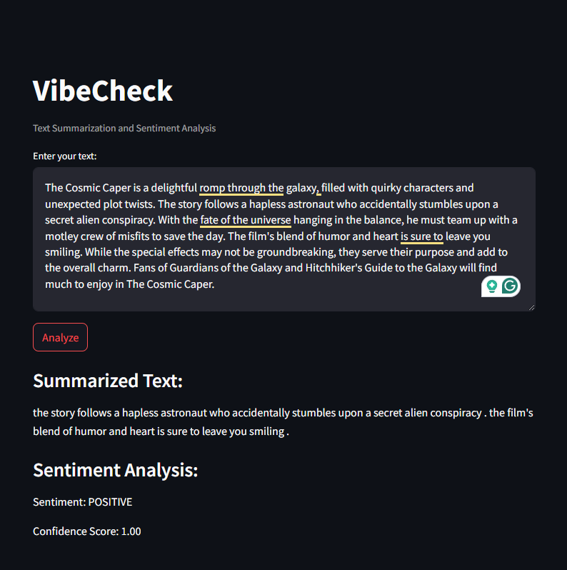

# VibeCheck

## Overview
VibeCheck is a simple yet powerful web application that utilizes Natural Language Processing (NLP) to summarize text and analyze its sentiment. Built using the `Streamlit` framework and the Hugging Face Transformers library, VibeCheck provides users with insights into the tone and essence of their input text.

Deployment
VibeCheck is deployed on Streamlit Sharing. You can access the live application at: [VibeCheck](https://vibecheck.streamlit.app/)

## Features
- **Text Summarization**: Input any piece of text, and VibeCheck will provide a concise summary, capturing the main points effectively.
- **Sentiment Analysis**: Get an immediate understanding of the sentiment behind the text. The application categorizes the sentiment as positive, negative, or neutral along with a confidence score.
- **User-Friendly Interface**: Designed with simplicity in mind, VibeCheck allows users to easily input text and view results instantly.

## Technologies Used
- **Python**: The core programming language for backend processing.
- **Streamlit**: For building the interactive web application interface.
- **Hugging Face Transformers**: For advanced NLP tasks, including text summarization and sentiment analysis.
 - Condenses lengthy texts into concise summaries using the `T5 model`
 - Classifies the sentiment of the text or its summary as positive, negative, or neutral using `DistilBERT`.
- **PyTorch**: As the underlying framework for the machine learning models used in this application.

## Acknowledgments
- Hugging Face for providing the Transformers library.
- The creators of the T5 and DistilBERT models for their contributions to NLP research.
